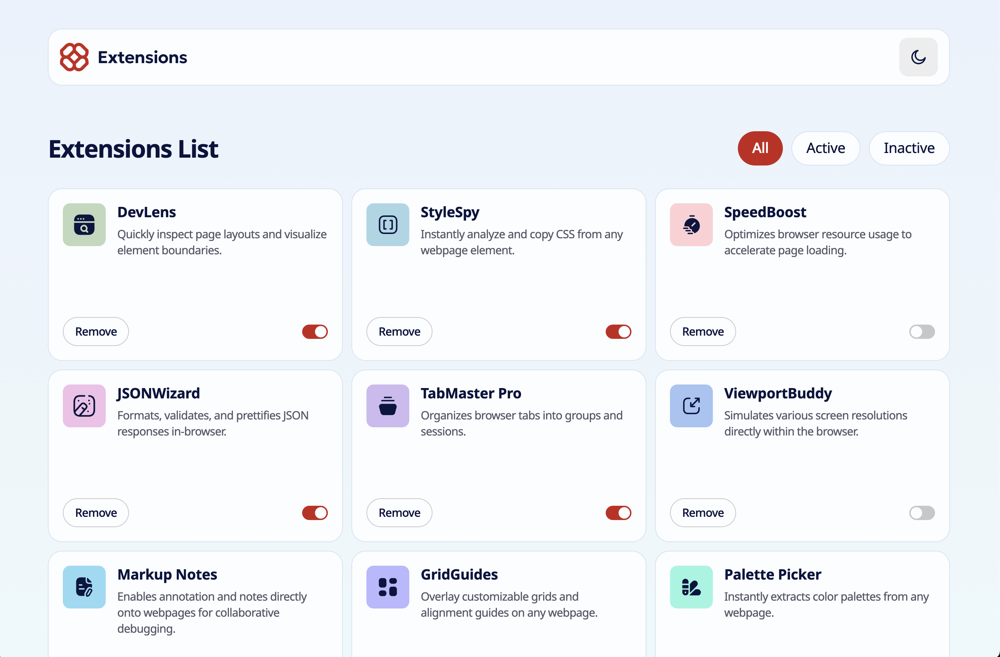

# Frontend Mentor - Browser extensions manager UI solution

This is a solution to the [Browser extensions manager UI challenge on Frontend Mentor](https://www.frontendmentor.io/challenges/browser-extension-manager-ui-yNZnOfsMAp). Frontend Mentor challenges help you improve your coding skills by building realistic projects. 

## Table of contents

- [Overview](#overview)
  - [The challenge](#the-challenge)
  - [Screenshot](#screenshot)
  - [Links](#links)
- [My process](#my-process)
  - [Built with](#built-with)
  - [What I learned](#what-i-learned)
- [Author](#author)

## Overview

### The challenge

Users should be able to:

- Toggle extensions between active and inactive states
- Filter active and inactive extensions
- Remove extensions from the list
- Select their color theme
- View the optimal layout for the interface depending on their device's screen size
- See hover and focus states for all interactive elements on the page

### Screenshot



### Links

- Solution URL: [https://github.com/hackz101/browser-extensions-manager-ui-main](https://github.com/hackz101/browser-extensions-manager-ui-main)
- Live Site URL: [https://browser-extensions-manager-ui-main-chi.vercel.app/](https://browser-extensions-manager-ui-main-chi.vercel.app/)

## My process

### Built with

- Semantic HTML5 markup
- CSS custom properties
- Flexbox
- CSS Grid
- Responsive Design
- [Normalize.css](https://necolas.github.io/normalize.css/) - For CSS Resets

### What I learned

I learned a few things while going through this challenge:

- **There may be mobile flickering on inputs or anything with a tab index due to default touch styling**
To fix this, all I had to do was change the default tap highlight color.

```css
button,
input,
.active-toggle {
  -webkit-tap-highlight-color: transparent;
}
```

- **You can get around mobile sticky hover by checking the input via media queries**
Inside you put your hover styles.

```css
@media (hover: hover) and (pointer: fine) {
  ...
}
```

- **Instead of media queries, you can use auto-fit with minmax on grids to make them responsive**
The auto-fit puts as many columns as it can while the minmax gives the minimum and maximum widths of those columns.

```css
.extension-grid {
  display: grid;
  grid-template-columns: repeat(auto-fit, minmax(21.5rem, 1fr));
  gap: 0.75rem;
  justify-content: center;
}
```

- **You can overwrite css variables**
This can be used for color theme variables which can be switched between.

```css
:root {
  --bg-gradient: linear-gradient(180deg, #EBF2FC 0%, #EEFBF9 100%);
  --color-content-bg: hsl(200, 60%, 99%);
  --color-theme-border: hsl(217, 61%, 90%);
  --color-theme-toggle: hsl(0, 0%, 93%);
  ...
}
...
.dark {
  --bg-gradient: linear-gradient(180deg, #04091B 0%, #091540 100%);
  --color-content-bg: hsl(226, 25%, 17%);
  --color-theme-border: hsl(217, 61%, 90%);
  --color-theme-toggle: hsl(225, 23%, 24%);
  ...
}
```

- **You can't directly change the fill inside of an svg if you are using an img tag**
To fix this, you either need to inline the svg or you have to dynamically load it in.
The route I took was actually just making a dark svg and changing the color of the fill.

## Author

- Frontend Mentor - [@hackz101](https://www.frontendmentor.io/profile/hackz101)